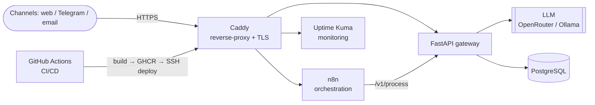
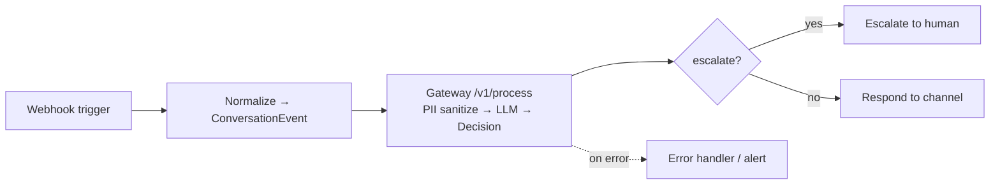

# AI Automation & Backend Engineer

Building AI-powered automation that ships to **production** — not tutorials. Python · n8n · Docker · LLMs.

💻 **Code & docs:** [AI Automation Hub](https://github.com/KiBrueg/n8n-automation)

---

## 🚀 AI Automation Hub

A modular AI-automation platform: **one engine, pluggable "modes" added by config — no code rewrite.**
Built with hard data contracts, switchable LLM providers, and full production ops (CI/CD, backups, monitoring).

### 🧩 System architecture

### 🔄 Core n8n workflow

### ✅ What's inside
- 🐳 Full Docker stack: **n8n · FastAPI · PostgreSQL · Caddy (auto-HTTPS)**
- ⚙️ **Green CI** (ruff + tests) and **automated CD** — every push builds, pushes to GHCR and deploys to a live VPS
- 💾 Daily Postgres backups · 📊 uptime monitoring · 🔒 PII sanitizer before the LLM
- 🔌 Switchable LLM providers (OpenRouter / Ollama) and pluggable modes — **new product = new config, core untouched**

---

### 🛠️ Tech
`Python` · `FastAPI` · `Pydantic` · `n8n` · `Docker / Compose` · `PostgreSQL` · `Caddy / HTTPS` · `GitHub Actions (CI/CD)` · `LLM APIs` · `Linux / VPS`

### 🎯 Open to (remote)
**AI Automation Engineer · Junior Backend · AI Workflow Engineer · Junior Platform / DevOps**

### 📫 Connect
[LinkedIn](https://www.linkedin.com/in/ki-brueg-2520033bb) · [AI Automation Hub repo](https://github.com/KiBrueg/n8n-automation)
